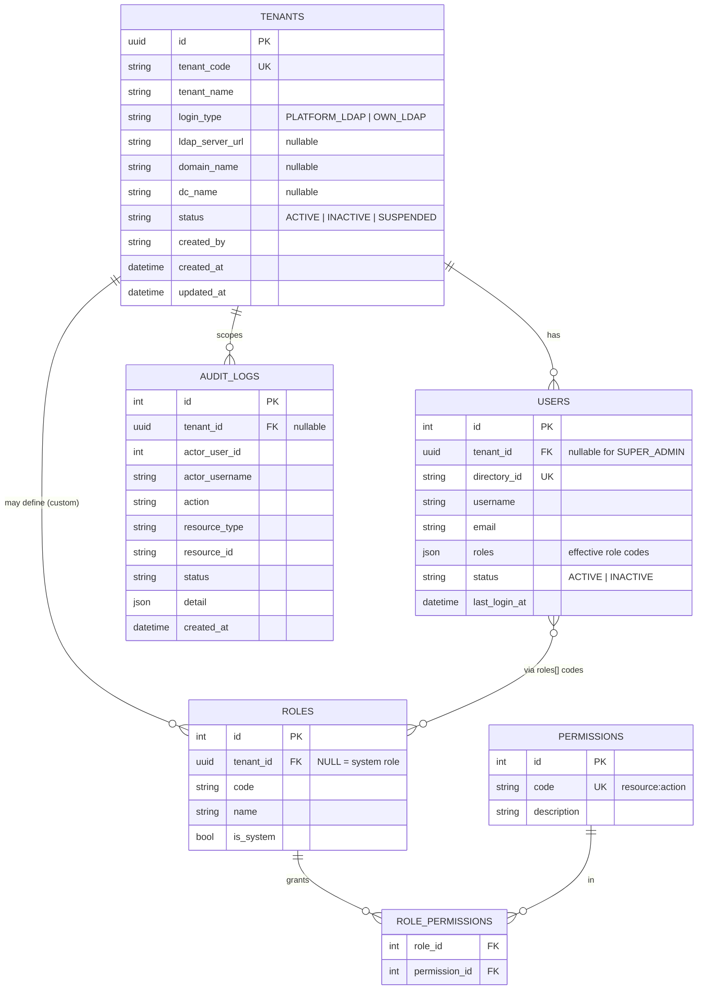
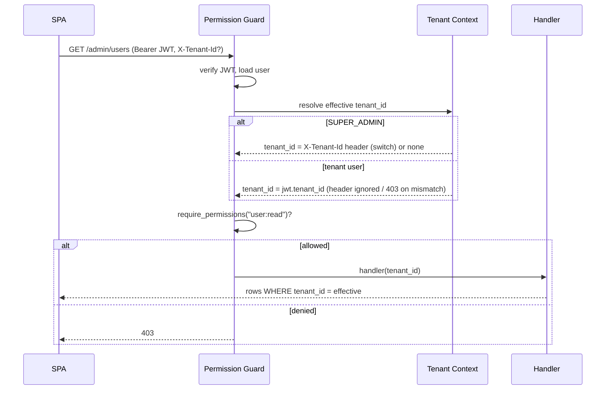

# Enterprise Multi-Tenancy Architecture — HCM Hybrid Cloud Portal

**Status:** Design + Phase-1 backend foundation
**Audience:** Engineering lead / architecture review
**Author:** Platform Engineering
**Pattern reference:** HPE Morpheus Data multi-tenancy (Tenants / Business Units + role-scoped administration)

---

## 1. Executive Summary

We are adding **enterprise-grade multi-tenancy** to the existing HCM Hybrid Cloud
Portal so a single deployment can safely serve many isolated **Business Units (BUs)**.

Key design choices (approved):

| Decision | Choice | Why |
|---|---|---|
| **Data isolation** | Shared DB + Shared Schema + `tenant_id` (row-level) | Cheapest to operate, scales to thousands of BUs, minimal change to current schema, enforced centrally (app filter + optional Postgres RLS). Same model Morpheus/Salesforce use. |
| **RBAC source of truth** | DB-managed roles & permissions; **LDAP for authentication only** | Admins provision users and assign roles/permissions in-app. LDAP only verifies the password. Clean audit trail, no dependency on AD group sprawl. |
| **Tenant nesting** | None (flat tenants) | Spec requirement — no sub-tenants. Simpler isolation and reasoning. |
| **Administration UI** | Separate, lazy-loaded Angular module, role-gated | Keeps platform/tenant management isolated from business modules. |

**Backward compatibility is a hard requirement.** Every change is additive. Existing
LDAP login, the dashboard, and the VMware module keep working unchanged. A `DEFAULT`
tenant is seeded and all pre-existing users are backfilled into it.

---

## 2. Tenancy Hierarchy & Roles

```
PLATFORM (no tenant)
  └── SUPER_ADMIN ............ internal platform team; full access; onboards tenants
        │  creates
        ▼
  TENANT (Business Unit)  ── tenant_id (UUID)
        ├── TENANT_ADMIN ..... manages ONLY their tenant (users, roles, infra, settings)
        ├── APPROVER ......... approves requests within their tenant
        ├── USER ............. standard user, tenant-scoped
        ├── READ_ONLY ........ read-only, tenant-scoped
        └── CUSTOM_ROLE(s) ... tenant-defined roles (composed of permissions)
```

| Role | Scope | tenant_id | Capabilities |
|---|---|---|---|
| `SUPER_ADMIN` | Platform | `NULL` | Everything. Create/activate/deactivate tenants, create tenant admins, view all logs, global settings, **switch tenant context**. |
| `TENANT_ADMIN` | One tenant | set | Manage own users, roles (custom), infra, tenant settings, view own audit logs. **Cannot** access platform settings or other tenants. **Cannot** create sub-tenants. |
| `APPROVER` | One tenant | set | Read + approve workflows within tenant. |
| `USER` | One tenant | set | Use own tenant's dashboards/resources. |
| `READ_ONLY` | One tenant | set | Read-only within tenant. |
| `CUSTOM_ROLE` | One tenant | set | Defined by TENANT_ADMIN from the permission catalog. |

---

## 3. Enterprise Architecture Diagram

```mermaid
flowchart TB
  subgraph Client["Angular SPA"]
    UI[Business Modules\nDashboard / VMware / Clouds]
    ADMIN[Administration Module\n(lazy, role-gated)]
    INT[JWT Interceptor\n+ X-Tenant-Id]
  end

  subgraph API["FastAPI Backend"]
    direction TB
    MW[SecureHeaders + CORS]
    AUTH[/auth: LDAP bind → issue JWT/]
    TC[Tenant Context\nextract tenant_id from JWT]
    RBAC[Permission Guards\nrequire_permissions / require_roles]
    ADMINAPI[/admin: tenants, users,\nroles, audit/]
    BIZ[/business APIs:\nusers/me, vmware, .../]
  end

  subgraph Identity["Active Directory"]
    PLDAP[(Platform LDAP)]
    OLDAP[(Tenant Own LDAP)]
  end

  subgraph Data["PostgreSQL (shared schema)"]
    T[(tenants)]
    U[(users · tenant_id)]
    R[(roles · permissions)]
    A[(audit_logs · tenant_id)]
    B[(business tables · tenant_id)]
  end

  UI --> INT --> API
  ADMIN --> INT
  AUTH --> PLDAP
  AUTH --> OLDAP
  MW --> AUTH --> TC --> RBAC
  RBAC --> ADMINAPI --> Data
  RBAC --> BIZ --> Data
```

Every request flows: **CORS/headers → auth (JWT verify) → tenant context → permission
guard → handler → tenant-filtered query**.

---

## 4. Data Model (Shared Schema + `tenant_id`)

### 4.1 ER Diagram



### 4.2 Isolation rule

> **Every tenant-scoped table carries `tenant_id`, and every data-access path filters by
> the caller's tenant_id unless the caller is `SUPER_ADMIN`.**

Tables to carry `tenant_id` as the program rolls out: `users`, `audit_logs`,
`infrastructure`, `assets`, `vm_records`, `environments`, `deployments`, `approvals`,
`workflows`, `dashboards`. (Phase 1 implements it on `users` and `audit_logs`; the
`TenantScopedMixin` makes adding it to future tables a one-liner.)

### 4.3 Defense in depth

1. **Application filter (primary):** all tenant-scoped queries go through service
   functions that take `tenant_id` and add `WHERE tenant_id = :tid`. SUPER_ADMIN may
   pass an explicit target (tenant switch).
2. **PostgreSQL Row-Level Security (optional hard backstop):** see §11 — a `SET app.tenant_id`
   per request + RLS policy so a missing filter cannot leak rows.

---

## 5. AuthN / AuthZ — RBAC + JWT

### 5.1 JWT claims (issued by our API after LDAP bind)

```jsonc
{
  "sub": "user-objectGUID",       // stable directory id (unchanged)
  "tenant_id": "uuid-or-null",    // NEW — null for SUPER_ADMIN
  "role": "TENANT_ADMIN",         // NEW — primary role
  "roles": ["TENANT_ADMIN"],      // kept for backward compatibility
  "permissions": ["user:create", "user:read", ...], // NEW — flattened
  "name": "...", "email": "...", "username": "...",
  "iss": "hcm-platform-api", "aud": "hcm-platform",
  "iat": ..., "nbf": ..., "exp": ...
}
```

### 5.2 Login (JWT) flow

```mermaid
sequenceDiagram
  participant SPA
  participant API as FastAPI /auth/login
  participant LDAP as AD (platform or tenant own)
  participant DB as PostgreSQL

  SPA->>API: POST /auth/login {username, password}
  API->>LDAP: bind (verify password) + read attributes
  LDAP-->>API: OK + directory profile
  API->>DB: find user by directory_id
  alt provisioned & ACTIVE
    DB-->>API: user (tenant_id, roles)
  else not provisioned
    API->>DB: (dev) auto-provision into DEFAULT tenant\n(prod) reject — must be invited
  end
  API->>DB: resolve permissions for roles
  API-->>SPA: JWT {tenant_id, role, permissions} + profile
  Note over SPA: token stored; sent as Bearer + X-Tenant-Id
```

### 5.3 Authorization flow (per request)



### 5.4 Permission catalog (resource:action)

`tenant:create|read|update|delete|switch`, `user:create|read|update|delete`,
`role:create|read|update|delete`, `permission:read`, `audit:read`,
`ldap:read|update`, `tenant_settings:read|update`, `platform_settings:manage`,
`infra:read|manage`, `access_control:read|manage`.

`SUPER_ADMIN` holds the wildcard `*` (bypasses every check).

---

## 6. Backend Folder Structure Changes

```
backend/app/
├── core/
│   ├── config.py            (MOD) tenancy + super-admin bootstrap settings
│   ├── security.py          (MOD) JWT now carries tenant_id/role/permissions
│   ├── rbac.py              (NEW) permission catalog + system-role definitions
│   └── tenant_context.py    (NEW) TenantContext + extraction helpers
├── models/
│   ├── user.py              (MOD) + tenant_id, status
│   ├── mixins.py            (NEW) TenantScopedMixin, TimestampMixin
│   ├── tenant.py            (NEW) Tenant
│   ├── rbac.py              (NEW) Role, Permission, role_permissions
│   └── audit.py             (NEW) AuditLog
├── schemas/
│   ├── tenant.py            (NEW)
│   ├── admin.py             (NEW) admin user create/update, role schemas
│   └── audit.py             (NEW)
├── dependencies/
│   ├── auth.py              (MOD) expose claims; helpers reused
│   └── tenant.py            (NEW) get_tenant_context, require_permissions, get_current_admin
├── services/
│   ├── user_service.py      (MOD) tenant-aware provisioning
│   ├── tenant_service.py    (NEW)
│   ├── rbac_service.py      (NEW)
│   └── audit_service.py     (NEW)
├── api/v1/endpoints/
│   ├── auth.py              (MOD) DB-RBAC login
│   └── admin/               (NEW)
│       ├── __init__.py
│       ├── tenants.py       (NEW)
│       ├── users.py         (NEW)
│       ├── roles.py         (NEW)
│       └── audit.py         (NEW)
├── api/v1/router.py         (MOD) mount admin routers
├── db/
│   └── bootstrap.py         (NEW) seed permissions/roles/default tenant/super admin
└── main.py                  (MOD) run bootstrap on startup
backend/migrations/
└── 001_multitenancy.sql     (NEW) idempotent ALTER/CREATE for existing DBs
```

---

## 7. Angular Folder Structure Changes (Phase 2 — next session)

```
frontend/src/app/
├── core/
│   ├── models/{tenant,role,permission}.model.ts   (NEW)
│   ├── services/tenant-context.service.ts          (NEW) holds active tenant
│   ├── guards/permission.guard.ts                  (NEW) data: { permission }
│   └── interceptors/auth.interceptor.ts            (MOD) add X-Tenant-Id
├── features/administration/                        (NEW, lazy)
│   ├── administration.routes.ts
│   ├── administration.component.ts                 (shell + sub-nav)
│   ├── tenant-management/ user-management/ role-management/
│   ├── permissions/ ldap-config/ audit-logs/
│   ├── tenant-settings/ platform-settings/
│   ├── infrastructure-isolation/ access-control/
└── (dashboard sidebar gains a role-gated "Administration" entry)
```

The Administration module is **lazy-loaded** and guarded by
`permissionGuard('tenant:read')` so its code never ships to a normal user's session
and the menu entry is hidden unless `role ∈ {SUPER_ADMIN, TENANT_ADMIN}`.

---

## 8. API Changes (Phase 1)

| Method | Path | Permission | Notes |
|---|---|---|---|
| POST | `/api/v1/auth/login` | public | now embeds tenant_id/role/permissions |
| GET | `/api/v1/users/me` | authenticated | now returns tenant_id, status |
| GET | `/api/v1/admin/tenants` | `tenant:read` | SUPER_ADMIN: all; else own |
| POST | `/api/v1/admin/tenants` | `tenant:create` | SUPER_ADMIN only |
| GET | `/api/v1/admin/tenants/{id}` | `tenant:read` | own unless SUPER_ADMIN |
| PATCH | `/api/v1/admin/tenants/{id}` | `tenant:update` | activate/deactivate, edit |
| GET | `/api/v1/admin/users` | `user:read` | tenant-scoped |
| POST | `/api/v1/admin/users` | `user:create` | tenant_id auto-bound from JWT |
| PATCH | `/api/v1/admin/users/{id}` | `user:update` | role/status; same-tenant enforced |
| GET | `/api/v1/admin/roles` | `role:read` | system + tenant custom |
| POST | `/api/v1/admin/roles` | `role:create` | custom roles (tenant) |
| GET | `/api/v1/admin/permissions` | `permission:read` | catalog |
| GET | `/api/v1/admin/audit` | `audit:read` | tenant-scoped log |

**Cross-tenant protection:** tenant-scoped handlers resolve the effective `tenant_id`
from `TenantContext`; a tenant user can never read/write another tenant's `tenant_id`
even by guessing IDs (404/403). SUPER_ADMIN bypass is explicit and audited.

---

## 9. Tenant Registration (SUPER_ADMIN)

Fields captured on tenant creation:

- `tenant_id` (UUID, autogenerated)
- `tenant_code` (unique BU code / domain)
- `tenant_name`
- `login_type` — `PLATFORM_LDAP` or `OWN_LDAP`
- If `OWN_LDAP`: `ldap_server_url`, `domain_name`, `dc_name`
- `created_by`, `created_date`, `updated_date`, `tenant_status`

---

## 10. Migration Strategy

1. **New tables** (`tenants`, `roles`, `permissions`, `role_permissions`, `audit_logs`)
   are created automatically by `Base.metadata.create_all` on startup, and explicitly by
   `migrations/001_multitenancy.sql` for managed environments.
2. **Existing `users` table** gets `tenant_id` + `status` via idempotent
   `ALTER TABLE ... ADD COLUMN IF NOT EXISTS`.
3. **Seed** (`db/bootstrap.py`, idempotent): permission catalog, system roles,
   the `DEFAULT` tenant, and the bootstrap `SUPER_ADMIN` (from env).
4. **Backfill:** existing users get `tenant_id = DEFAULT` and `status = ACTIVE`.

Rollback = drop the new tables and the two new columns; existing flows are unaffected.

---

## 11. Infrastructure Isolation (K8s & cloud)

- **Namespace per tenant:** `tenant-<tenant_code>`; deployments, quotas, and
  NetworkPolicies scoped to it.
- **Resource tagging:** every provisioned object labelled
  `hcm.io/tenant-id=<uuid>` / `hcm.io/tenant-code=<code>` for cost & policy.
- **NetworkPolicy:** default-deny cross-namespace traffic so BUs cannot reach each other.
- **ResourceQuota / LimitRange** per namespace for fair-share.
- **Cloud readiness:** the same `tenant_id` tag maps to AWS tags / Azure resource groups /
  GCP labels later — no schema change required.

Optional Postgres RLS backstop:

```sql
ALTER TABLE users ENABLE ROW LEVEL SECURITY;
CREATE POLICY tenant_isolation ON users
  USING (tenant_id = current_setting('app.tenant_id', true)::uuid
         OR current_setting('app.tenant_id', true) = 'SUPER_ADMIN');
-- app sets:  SET app.tenant_id = '<uuid>'  (or 'SUPER_ADMIN') per request
```

---

## 12. Audit & Security

- **Audit log** table records actor, action, resource, tenant, status, IP/agent, detail.
- **Tenant activity tracking** + **login tracking** + **API audit trail** flow through one
  `audit_service.record(...)` helper called from admin handlers and login.
- **OWASP alignment:** server-side authZ on every route, no client-trusted tenant_id,
  generic auth errors (no user enumeration), secure headers middleware (already present),
  parameterized queries (SQLAlchemy), least-privilege permissions, short-lived JWTs.
- **Monitoring hooks:** audit rows are queryable per tenant; emit counters
  (logins, denials, tenant switches) to your metrics pipeline.

---

## 13. Exact Implementation Steps

**Phase 1 — Backend foundation (this session)**
1. Config + env: tenancy flags + super-admin bootstrap.
2. Models: `Tenant`, `Role`, `Permission`, `role_permissions`, `AuditLog`; extend `User`.
3. Schemas: tenant / admin-user / role / audit.
4. RBAC catalog + tenant context + permission dependencies.
5. JWT claims + DB-RBAC login.
6. Services: tenant / rbac / audit; tenant-aware user provisioning.
7. Admin endpoints + router wiring.
8. Bootstrap seed + SQL migration + startup hook.

**Phase 2 — Angular Administration module (next session)**
9. Lazy `administration` feature, sub-routes, permission guard.
10. Dynamic role-based sidebar entry; tenant-context service + interceptor header.
11. Tenant Management + User Management screens; scaffolds for the rest.

**Phase 3 — Roll tenant_id onto business tables + Postgres RLS + K8s manifests.**

---

## 14. Backward Compatibility Guarantees

- `User.roles` (JSON) is preserved and remains the effective role list; `require_roles`
  keeps working. New `require_permissions` is layered on top.
- Existing `/auth/login`, `/users/me`, `/vmware/*` keep their contracts (only additive
  fields appear).
- A `DEFAULT` tenant + `AUTH_REQUIRE_DB_PROVISIONING=false` (dev default) means current
  LDAP users keep logging in exactly as before until you flip on strict provisioning.
```
